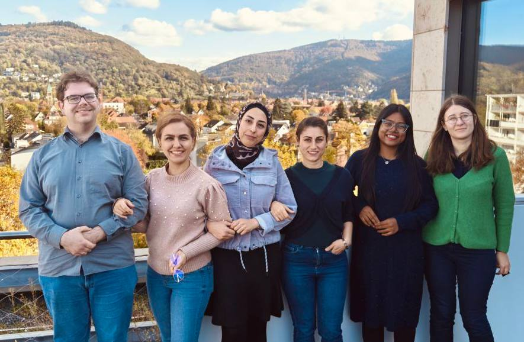

---
---

# Mathematics and AI Website 

Welcome! 

Our group (started September 2024) is funded by the Federal Ministry of Education and Research (BMBF) through project OIDLITDSM in the field of AI. It is located at the Interdisciplinary Center for Scientific Computing (IWR), Heidelberg University. 
Research

We are mainly interested in two research directions:

Mathematical Foundations of AI. We aim to develop a mathematical foundation for understanding the design, training, and operation of deep learning models, particularly Recurrent Neural Networks (RNNs), which are effective neural architectures for time series analysis, forecasting, and modeling dynamical systems. We integrate dynamical systems theory, specifically Koopman operator theory, into the field of AI to establish a rigorous framework for creating novel, theoretically motivated AI algorithms and architectures for interpretable data-driven modeling of complex dynamical systems. 

AI for Solving Mathematical Problems. There has been a substantial paradigm shift in the field of mathematics, particularly in applied mathematics, due to the utilization of AI techniques. In this context, we use neural networks to analyze and develop numerical algorithms for approximating solutions to Partial Differential Equations (PDEs) through machine learning approaches. We will also examine some mathematical inverse problems, such as determining governing differential equations from given datasets with such techniques.

Other directions. Another focus of our group is developing deep learning frameworks to enhance neuroimaging analysis by integrating various types of brain imaging data. This approach merges structural and functional information to better understand brain health, particularly in relation to neurodegenerative diseases. This methodology aims to identify patterns in brain structure and activity, which could improve diagnostic accuracy and monitor disease progression.



## 
** this is some more description
